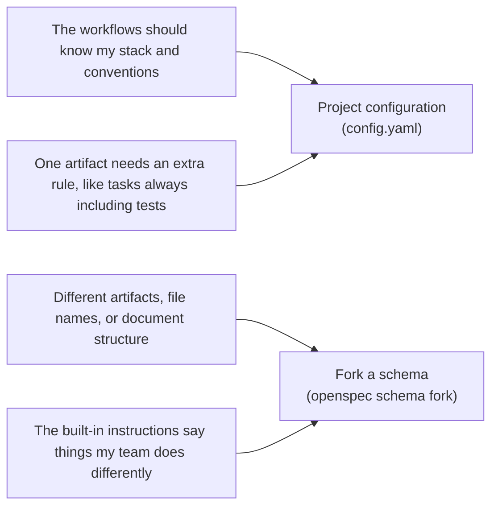

# Overview

> Your options for customizing OpenSpec.

OpenSpec supports multiple customization options. This page shows what each one changes and when to use it.

## What you can customize

| Option | What it changes | Use it when |
|---|---|---|
| [Profiles](profiles.md) | Which workflows are installed, and whether as skills, commands, or both | You want additional workflows and working patterns, or to remove workflows you don't need |
| [Project configuration](project-config.md) | The instructions injected into every workflow run: context, rules, and operation guidance (`config.yaml`) | You want changes planned your way, like tasks always including Playwright tests |
| [Schemas](schemas.md) | What OpenSpec produces: the artifacts, their order, and their templates | Changes should produce different planning files, sections, or formats |

## Not sure which to use?

Config and schemas are two levels of customization. Pick by how hands-on you want to get:

- **Start with [project configuration](project-config.md)**: it's lighter, and for most projects it's enough. You keep the standard artifacts and add your own context and rules on top.
- **Fork a [schema](schemas.md) when adding isn't enough**: config only adds on top of the core workflow. It can add a rule like "tasks always include tests," but it can't drop the design doc or rename a file. That's schema territory. Forking gives you your own copy to edit.

*"Fork" here means the `openspec schema fork` command, not forking a git repo. [Schemas](schemas.md) has the details.*

