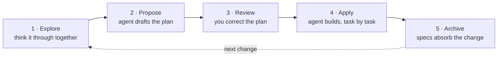

# Quickstart

> Your first change on your existing repo, from idea to archived.

Before you start, you need the CLI on your machine ([Installation](installation.md)) and OpenSpec initialized in your project ([Set up your project](setup.md)).

## The loop at a glance

Every change moves through the same five steps: you think the idea through with your agent, it drafts a plan, you correct the plan before any code exists, the agent builds from it, and archiving updates your specs with what shipped.



Every prompt below goes in your AI chat, the same place you ask for code. Each invokes an OpenSpec skill by name, the same spelling in every tool. A plain ask works too ("propose a change to add rate limiting"). Some tools add shorter command aliases (`/opsx:propose` in Claude Code, [other tools vary](../reference/supported-tools.md)).

## Step 1: Explore

Think the idea through with your agent before you ask for a plan. In your AI chat:

```text
/openspec-explore how rate limiting should work in this app
```

Explore is a thinking mode. The agent investigates your codebase, asks the questions that matter, sketches options, and challenges assumptions. It writes no code and no files. The output is a sharper idea.

Stay here as long as the problem needs. When the shape feels right, hand it off:

```text
/openspec-propose
```

That line starts propose for you, carrying everything you settled. Skip the first prompt in step 2.

## Step 2: Propose

Propose turns the idea into a reviewable plan. Coming from explore, it's already running. Starting cold, when the change is clear in your head, ask directly. In your AI chat:

```text
/openspec-propose add rate limiting
```

The agent asks what it needs to, then writes a change folder:

```
openspec/changes/add-rate-limiting/
├── proposal.md    why, and what changes
├── specs/         what "done" means, as testable requirements
├── design.md      technical decisions (only when the change needs one)
└── tasks.md       the implementation checklist
```

No code yet. Propose stops at the plan.

## Step 3: Review and correct the plan

Fix the plan while it's still words and nothing is built yet. Read in this order:

- **`proposal.md`**: is this the right problem, at the right size?
- **`specs/`**: the highest-value read. Would you accept these requirements as done?
- **`tasks.md`**: do the tasks cover the specs, and nothing more?

To fix something, either works:

- Edit the file yourself. The artifacts are plain markdown, and the files are the plan.
- Tell your agent what's wrong ("the spec is missing the unauthenticated case"). It revises the artifacts.

## Step 4: Apply

Apply turns the plan into code. Start a fresh chat session, since implementation goes better on a clean context window. In your AI chat:

```text
/openspec-apply-change add-rate-limiting
```

The agent reads the change folder, then works through `tasks.md`, checking off each task as it lands.

- **Interrupted, or out of context?** Open a new session and ask it to apply again. It resumes at the first unchecked task.
- **Plan turned out wrong?** Fix the artifacts (either way from step 3), then continue applying.
- **Progress** lives in the `tasks.md` checkboxes. There is no hidden state.

## Step 5: Archive

Archiving does two things: it updates your main specs with the change's requirements, and it moves the change folder into the archive folder (in `/openspec/changes/archive/*`).

When every box in `tasks.md` is checked, in your AI chat:

```text
/openspec-archive-change add-rate-limiting
```

Step through what archiving does:

```file-steps
## The finished change
> Implementation is done. The delta spec (what this change adds) still sits inside the change folder; specs/ doesn't know about rate limiting yet.
  openspec/
  ├── specs/                                   (no rate-limiting spec yet)
  └── changes/
      └── add-rate-limiting/
          ├── proposal.md
          ├── tasks.md                         every box checked
          └── specs/
              └── rate-limiting/
                  └── spec.md                  the delta: ADDED requirements

## Requirements land in specs/
> Each requirement in the delta lands in the main spec: added ones append, modified ones replace their old version. A new capability gets a new spec file.
  openspec/
  ├── specs/
+ │   └── rate-limiting/
+ │       └── spec.md                          gains "Requirement: Rate limiting"
  └── changes/
      └── add-rate-limiting/
          └── specs/
              └── rate-limiting/
                  └── spec.md                  the delta, source of the merge

## The folder moves to archive/
> The whole change folder, delta included, moves into the archive under a date prefix. Nothing is deleted.
  openspec/
  ├── specs/
  │   └── rate-limiting/
  │       └── spec.md
  └── changes/
-     └── add-rate-limiting/
+     └── archive/
+         └── 2026-08-08-add-rate-limiting/
+             ├── proposal.md
+             ├── tasks.md
+             └── specs/rate-limiting/spec.md

## Specs describe the system as built
> changes/ is clear for the next change. specs/ is the source of truth for what the system does; archive/ is the history of how it got there.
  openspec/
  ├── specs/
  │   └── rate-limiting/
  │       └── spec.md                          the spec as built
  └── changes/
      └── archive/
          └── 2026-08-08-add-rate-limiting/
```

Git is a separate concern. Commit the change folder with the code, and nothing else about your workflow changes. When to archive relative to a PR is a team convention; the [Teams](../guides/teams.md) guide has the tradeoff.

## Going further

- [Concepts](../guides/concepts.md): what the two artifacts are, and how a delta describes a change.
- [Explore](../guides/explore.md): getting more out of explore mode.
- [Apply](../guides/apply.md): pacing, context windows, resuming long changes.
- [Review the plan](../guides/review-the-plan.md): what to look for in specs before you build.
- [Profiles](../customize/profiles.md): optional workflows beyond the core set (verify before archive, incremental planning).

## Advanced guides

<!-- Planned pages, not yet written or in the README page map. Listed here so the quickstart routes to them once they exist. -->

Not written yet; guides we plan to add:

- **Prototype first**: spike the code before any spec, then backfill the proposal from what the prototype taught you.
- **Building iteratively**: a sequence of small changes instead of one big proposal.
- **Revising an implemented change**: the plan needs to move again after apply, but the change hasn't merged or archived yet.
